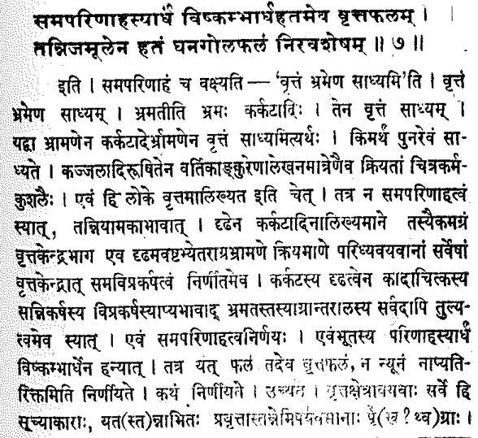

```{r setup, include=FALSE}
knitr::opts_chunk$set(echo = FALSE)
library(emo)
```

```{r}
library(RColorBrewer)
bgcol <- "burlywood"
rectcol <- "lightgray"
myPal <- brewer.pal(n = 3, "Set2")
```

# Prolegomena Quadratica { .center }


## Congratulations, Pat Costello!

<br>
<br>
Prof. Costello's doctoral training was in quadratic forms.

## Brahmagupta

* *Brahmasphutasiddhanta* (628 CE)
* Like most other text, contains substantial material on astronomy/astrology.
* First surviving text to distinguish between:
    - "manifest" computation (arithmetic)
    - "unmanifest" computation (algebra, more or less)
* Impressive contributions in several areas, including
    * geometry
    * number theory ("square-nature" problems, AKA quadratic forms!)
   
## So He Was Good ...

... and was only too happy to say so:

* "If [Aryabhata's] constants give the correct results for conjunctions and eclipses, they must be considered as accidental as the letters cut into wood by weevils."  (BrShSi I.62)
* "Men who have learned from the works of Srisena, Visnucandra and Aryabhata cannot face me in any debate, like the deer who sees the lion."  (BrShSi I.63)

(Translation modified from Satya Prakash, see [2].)

## Square-Nature Lemma

From BrShSi 18.64-65:

64. Put down twice the square-root of a given square multiplied by a multiplier and increased or diminished by an arbitrary number.  The product of the first pair multiplied by the multiplier, with the product of the last pair, is the last computed.

65. The sum of the thunderbolts is the first ... .

## In Modern Parlance

Suppose that

* $(x,y) = (\alpha_1, \beta_1)$ satisfies $Nx^2 + k_1 = y^2$
* $(x,y) = (\alpha_2, \beta_2)$ satisfies $Nx^2 + k_2 = y^2$

Then a solution of $Nx^2 + k_1k_2 = y^2$ is:

$$(x,y) = (\alpha_1\beta_2 + \alpha_2\beta_1, N\alpha_1\alpha_2+\beta_1\beta_2).$$

This is called *composition* (*bhavana*, for the Indian mathematicians.)


## "Modern" Proof ($\approx$ J. Wallis, 1658 CE)

Assume that:

* $N\alpha_1^2 + k_1 = \beta_1^2$ (So $N\alpha_1^2 + k_1 = (-\beta_1)^2$)
* $N\alpha_2^2 + k_2 = \beta_2^2$

Consider "Brahmagupta's Identity":

$$(a^2+nb^2)(c+nd^2)=(ac+nbd)^2+n(ad-bc)^2.$$

Substitute:  $n = -N, a = -\beta_1, b = \alpha_1, c = \beta_2, d = \alpha_2$.


$$((-\beta_1)^2-N\alpha_1^2)(\beta_2^2-N\alpha_2^2)\\
=((-\beta_1)\beta_2-N\alpha_1\alpha_2)^2-N((-\beta_1)\alpha_2-\alpha_1\beta_2)^2.$$

##

$$
((-\beta_1)^2-N\alpha_1^2)(\beta_2^2-N\alpha_2^2) =\\
(\beta_1\beta_2+N\alpha_1\alpha_2)^2-N(\beta_1\alpha_2+\alpha_1\beta_2)^2,
$$

$$
(-k_1)(-k_2)=(\beta_1\beta_2+N\alpha_1\alpha_2)^2-N(\beta_1\alpha_2+\alpha_1\beta_2)^2,\\
N(\beta_1\alpha_2+\alpha_1\beta_2)^2+k_1k_2=(\beta_1\beta_2+N\alpha_1\alpha_2)^2,\\
N(\beta_1\alpha_2+\alpha_1\beta_2)^2+k_1k_2=(N\alpha_1\alpha_2 + \beta_1\beta_2)^2.
$$


## The Rest of Verse 65

65. ... The two square roots, divided by the additive or the subtractive, are the additive solutions.

## What Does This Mean?

Brahmagupta wants integral solutions of equations of the form $Nx^2 + 1 = y^2$. His idea:

Find a "close" solution for some $k$:  i.e., find $a,b$ so that $Na^2 + k = b^2$

Then by his lemma, *bhavana* of the with itself:

$$x = 2ab, \,\,y = Na^2+b^2.$$
solves:
$$Nx^2 + k^2 = y^2$$

## Case $k=-1$

We have:

$$Na^2 -1 = b^2.$$

Then the *bhavana* of the solutions with itself yields the desired integral solution immediately:

$$N(2ab)^2+1=(b^2+Na^2)^2.$$

## Case $k=\pm2$

We have:  $Na^2 \pm2 = b^2$.  Then *bhavana* gives:

$$N(2ab)^2+4=(b^2+Na^2)^2,\\
N(2ab)^2+4=(b^2+Na^2)^2,\\
N(2ab)^2+4=(b^2+b^2\mp2)^2,\\
N(2ab)^2+4=(2b^2 \mp2)^2,\\
N(ab)^2+1=(b^2 \mp)^2$$


*"The two square roots, divided by the additive or the subtractive, are the additive solutions."*

## Case $k=4$ (Possible Rationale)

Suppose that $a$ and $b$ are integers such that

$$Na^2 + 4 = b^2$$.

Then

$$N\left(\frac{a}{2}\right)^2+1=\left(\frac{b}{2}\right)^2.$$


##

*Bhavana* of $(a/2, b/2)$ with itself yields solution:

$$(\frac{ab}{2},\frac{b^2}{4}+N\frac{a^2}{4}).$$

Substituting $N = \frac{b^2-4}{a^2}$, this becomes:

$$(\frac{ab}{2},\frac{b^2}{4}+\frac{b^2-4}{4}).$$

If $b$ is even, then we are done.

##

If $b$ is odd, then perform *bhavana* of this most recent solution with $(a/2, b/2)$, eventually getting:

$$(a\frac{b^2-1}{2},b\frac{b^2-3}{2}).$$

This solution is integral.

## Case $k=-4$

A wee bit more complex than the previus case (at most one more *bhavana*).


## Later Developments

Jayadeva ($\sim 900$'s CE) is said to have developed the iterative *chakravala* ("cyclic") method that

* begins with integral "close" solution $Na^2+k=b^2$
* produces integral solutution for a new value of $k$
* eventually one reaches $k = \pm1,\pm2\pm4$.

Described by Bhaskara (1200s) in his *Bijaganita*.

A.A.K Ayyangar provides a proof (1930), said to contain error.

Anne Bauval (2010) gives a corrected, shorter proof.

## "Brahmagupta Identity"

$$(a^2+nb^2)(c^2+nd^2)=(ac+nbd)^2+n(ad-bc)^2,$$

used by us to verify to verify Brahamagupta's *bhavana* Lemma, is not mentioned by Brahmagupta.  

Also not mentioned in any extant pre-modern Indian proofs (that I know of).

But it inspired [Manjul Bhargava](https://plus.maths.org/content/conversation-manjul-bhargava) as a child.

# Nilakantha's Summations { .center }

## The Kerala School

* Flourished *circa* 1380-1600 CE.
* Founder and most important member:  Madhava of Samgamagrama
    * Infinite series formulas for trig functions
    * correction terms for partial-sum approximations
* Madhava and succesors develop concise and accurate trig tables.
* Successors develop astronomy, write illuminating commentaries.
* Nilakantha Somayagin (*circa* 1450-1550) is in this line.


## Aryabhatiyabhasya

* Nilakantha's late-in-life work, a commentary on the *Aryabhatiya* of Aryabhata (400's CE)
* Offers detailed proofs of most propositions.

## Typical Text (No Diagrams! `r ji("worried")`)



## Aryabhata 22

$$1^2+2^2+\ldots+n^2=\frac{n(n+1)(2n+1)}{6}.$$
$$1^3+2^3+\ldots+n^3=\left(\frac{n(n+1)}{2}\right)^2.$$


## Nilakantha's Proof (Cubes)

Part of it has been translated by Kim Plofker (in [1]).

My aim is to fill in the omitted passage.

##

```{r cache = TRUE}
plot(
  c(0, 10), c(0, 10), 
  type = "n", axes = FALSE, xlab = "", ylab = "", asp = 1)
rect(xleft = 0, ybottom = 0, xright = 10, ytop = 10, 
     border = "black", lwd = 3, col = bgcol)
mtext('1 + 2 + 3 + 4', side=1, line = 0.5, at=5)
mtext('1 + 2 + 3 + 4', side=2, line = -3.5, at=5)
```

##

```{r cache = TRUE}
plot(
  c(0, 10), c(0, 10), 
  type = "n", axes = FALSE, xlab = "", ylab = "", asp = 1)
rect(xleft = 0, ybottom = 0, xright = 10, ytop = 10, 
     border = "black", lwd = 3, col = bgcol)
mtext('1 + 2 + 3 + 4', side=1, line = 0.5, at=5)
mtext('1 + 2 + 3 + 4', side=2, line = -3.5, at=5)
mtext("North", side = 3, line = 2, at = 5)
mtext("South", side = 1, line = 2, at = 5)
mtext("East", side = 4, line = -2, at = 5)
mtext("West", side = 2, line = -2, at = 5)
mtext("Agneyakona", side = 1, line = 0, at = 12)
```

##

```{r cache = TRUE}
plot(
  c(0, 10), c(0, 10), 
  type = "n", axes = FALSE, xlab = "", ylab = "", asp = 1)
rect(xleft = 0, ybottom = 0, xright = 10, ytop = 10, 
     border = "black", lwd = 3, col = bgcol)
mtext('1 + 2 + 3 + 4', side=1, line = 0.5, at=5)
mtext('1 + 2 + 3 + 4', side=2, line = -3.5, at=5)
points(x = 6, y = 4, pch = 20, cex = 3)
```

##

```{r cache = TRUE}
plot(
  c(0, 10), c(0, 10), 
  type = "n", axes = FALSE, xlab = "", ylab = "", asp = 1)
rect(xleft = 0, ybottom = 0, xright = 10, ytop = 10, 
     border = "black", lwd = 3, col = bgcol)
mtext('1 + 2 + 3 + 4', side=1, line = 0.5, at=5)
mtext('1 + 2 + 3 + 4', side=2, line = -3.5, at=5)
lines(x = c(0,10), y = c(4, 4), lwd = 3)
lines(x = c(6,6), y = c(0, 10), lwd = 3)
text(8, 2, expression(1 %*% 4 %*% 4))
```

##

```{r cache = TRUE}
plot(
  c(0, 10), c(0, 10), 
  type = "n", axes = FALSE, xlab = "", ylab = "", asp = 1)
rect(xleft = 0, ybottom = 0, xright = 10, ytop = 10, 
     border = "black", lwd = 3, col = bgcol)
lines(x = c(0,10), y = c(4, 4), lwd = 3)
lines(x = c(6,6), y = c(0, 10), lwd = 3)
lines(x = c(1,1), y = c(0,4), lwd = 3)
lines(x = c(3,3), y = c(0,4), lwd = 3)
lines(x = c(6,10), y = c(9, 9), lwd = 3)
lines(x = c(6,10), y = c(7, 7), lwd = 3)
text(8, 2, expression(1 %*% 4 %*% 4))
mtext('1', side=1, line = 0.0, at=0.5)
mtext('2', side=1, line = 0.0, at=2)
mtext('3', side=1, line = 0.0, at=4.5)
mtext('4', side=2, line = -4, at=2)
mtext('1', side=4, line = -4, at=9.5)
mtext('2', side=4, line = -4, at=8)
mtext('3', side=4, line = -4, at=5.5)
mtext('4', side=3, line = 0, at=8)
```

##

```{r cache = TRUE}
plot(
  c(0, 10), c(0, 10), 
  type = "n", axes = FALSE, xlab = "", ylab = "", asp = 1)
rect(xleft = 0, ybottom = 0, xright = 10, ytop = 10, 
     border = "black", lwd = 3, col = bgcol)
lines(x = c(0,10), y = c(4, 4), lwd = 3)
lines(x = c(6,6), y = c(0, 10), lwd = 3)
lines(x = c(1,1), y = c(0,4), lwd = 3)
lines(x = c(3,3), y = c(0,4), lwd = 3)
lines(x = c(6,10), y = c(9, 9), lwd = 3)
lines(x = c(6,10), y = c(7, 7), lwd = 3)
text(8, 2, expression(1 %*% 4 %*% 4))
mtext('1', side=1, line = 0.0, at=0.5)
mtext('2', side=1, line = 0.0, at=2)
mtext('3', side=1, line = 0.0, at=4.5)
mtext('4', side=2, line = -4, at=2)
mtext('1', side=4, line = -4, at=9.5)
mtext('2', side=4, line = -4, at=8)
mtext('3', side=4, line = -4, at=5.5)
mtext('4', side=3, line = 0, at=8)
rect(xleft = 0, ybottom = 0, xright = 1, ytop = 4, 
     border = "black", lwd = 3, col = myPal[1])
rect(xleft = 1, ybottom = 0, xright = 4, ytop = 4, 
     border = "black", lwd = 3, col = myPal[2])
rect(xleft = 3, ybottom = 0, xright = 6, ytop = 4, 
     border = "black", lwd = 3, col = myPal[1])
rect(xleft = 6, ybottom = 4, xright = 10, ytop = 7, 
     border = "black", lwd = 3, col = myPal[1])
rect(xleft = 6, ybottom = 7, xright = 10, ytop = 9, 
     border = "black", lwd = 3, col = myPal[2])
rect(xleft = 6, ybottom = 9, xright = 10, ytop = 10, 
     border = "black", lwd = 3, col = myPal[1])
```

##

```{r cache = TRUE}
plot(
  c(0, 14), c(0, 14), 
  type = "n", axes = FALSE, xlab = "", ylab = "", asp = 1)
rect(xleft = 0, ybottom = 0, xright = 10, ytop = 10, 
     border = "black", lwd = 3, col = bgcol)
lines(x = c(0,10), y = c(4, 4), lwd = 3)
lines(x = c(6,6), y = c(0, 10), lwd = 3)
lines(x = c(1,1), y = c(0,4), lwd = 3)
lines(x = c(3,3), y = c(0,4), lwd = 3)
lines(x = c(6,10), y = c(9, 9), lwd = 3)
lines(x = c(6,10), y = c(7, 7), lwd = 3)
text(8, 2, expression(1 %*% 4 %*% 4))
rect(xleft = 0, ybottom = 0, xright = 1, ytop = 4, 
     border = "black", lwd = 3, col = myPal[1])
rect(xleft = 1, ybottom = 0, xright = 4, ytop = 4, 
     border = "black", lwd = 3, col = myPal[2])
rect(xleft = 3, ybottom = 0, xright = 6, ytop = 4, 
     border = "black", lwd = 3, col = myPal[1])
rect(xleft = 6, ybottom = 4, xright = 10, ytop = 7, 
     border = "black", lwd = 3, col = "white")
rect(xleft = 6, ybottom = 7, xright = 10, ytop = 9, 
     border = "black", lwd = 3, col = myPal[2])
rect(xleft = 6, ybottom = 9, xright = 10, ytop = 10, 
     border = "black", lwd = 3, col = "white")
rect(xleft = 10, ybottom = 10, xright = 14, ytop = 14, 
     border = "black", lwd = 3, col = myPal[1])
```

##

```{r cache = TRUE}
plot(
  c(0, 14), c(0, 14), 
  type = "n", axes = FALSE, xlab = "", ylab = "", asp = 1)
rect(xleft = 0, ybottom = 0, xright = 10, ytop = 10, 
     border = "black", lwd = 3, col = bgcol)
lines(x = c(0,10), y = c(4, 4), lwd = 3)
lines(x = c(6,6), y = c(0, 10), lwd = 3)
lines(x = c(1,1), y = c(0,4), lwd = 3)
lines(x = c(3,3), y = c(0,4), lwd = 3)
lines(x = c(6,10), y = c(9, 9), lwd = 3)
lines(x = c(6,10), y = c(7, 7), lwd = 3)
text(8, 2, expression(1 %*% 4 %*% 4))
rect(xleft = 0, ybottom = 0, xright = 1, ytop = 4, 
     border = "black", lwd = 3, col = "white")
rect(xleft = 1, ybottom = 0, xright = 4, ytop = 4, 
     border = "black", lwd = 3, col = myPal[2])
rect(xleft = 3, ybottom = 0, xright = 6, ytop = 4, 
     border = "black", lwd = 3, col = "white")
rect(xleft = 6, ybottom = 4, xright = 10, ytop = 7, 
     border = "black", lwd = 3, col = "white")
rect(xleft = 6, ybottom = 7, xright = 10, ytop = 9, 
     border = "black", lwd = 3, col = myPal[2])
rect(xleft = 6, ybottom = 9, xright = 10, ytop = 10, 
     border = "black", lwd = 3, col = "white")
rect(xleft = 10, ybottom = 10, xright = 14, ytop = 14, 
     border = "black", lwd = 3, col = myPal[1])
rect(xleft = 0, ybottom = 10, xright = 4, ytop = 14, 
     border = "black", lwd = 3, col = myPal[1])
```

##

```{r cache = TRUE}
plot(
  c(0, 14), c(0, 14), 
  type = "n", axes = FALSE, xlab = "", ylab = "", asp = 1)
rect(xleft = 0, ybottom = 0, xright = 10, ytop = 10, 
     border = "black", lwd = 3, col = bgcol)
lines(x = c(0,10), y = c(4, 4), lwd = 3)
lines(x = c(6,6), y = c(0, 10), lwd = 3)
lines(x = c(1,1), y = c(0,4), lwd = 3)
lines(x = c(3,3), y = c(0,4), lwd = 3)
lines(x = c(6,10), y = c(9, 9), lwd = 3)
lines(x = c(6,10), y = c(7, 7), lwd = 3)
text(8, 2, expression(1 %*% 4 %*% 4))
rect(xleft = 0, ybottom = 0, xright = 1, ytop = 4, 
     border = "black", lwd = 3, col = "white")
rect(xleft = 1, ybottom = 0, xright = 4, ytop = 4, 
     border = "black", lwd = 3, col = "white")
rect(xleft = 3, ybottom = 0, xright = 6, ytop = 4, 
     border = "black", lwd = 3, col = "white")
rect(xleft = 6, ybottom = 4, xright = 10, ytop = 7, 
     border = "black", lwd = 3, col = "white")
rect(xleft = 6, ybottom = 7, xright = 10, ytop = 9, 
     border = "black", lwd = 3, col = 'white')
rect(xleft = 6, ybottom = 9, xright = 10, ytop = 10, 
     border = "black", lwd = 3, col = "white")
rect(xleft = 10, ybottom = 10, xright = 14, ytop = 14, 
     border = "black", lwd = 3, col = myPal[1])
rect(xleft = 0, ybottom = 10, xright = 4, ytop = 14, 
     border = "black", lwd = 3, col = myPal[1])
rect(xleft = 5, ybottom = 10, xright = 9, ytop = 14, 
     border = "black", lwd = 3, col = myPal[1])
```

##

```{r cache = TRUE}
plot(
  c(0, 10), c(0, 10), 
  type = "n", axes = FALSE, xlab = "", ylab = "", asp = 1)
rect(xleft = 0, ybottom = 4, xright = 6, ytop = 10, 
     border = "black", lwd = 3, col = bgcol)
rect(xleft = 6, ybottom = 0, xright = 10, ytop = 4, 
     border = "black", lwd = 3, col = bgcol)
text(8, 2, expression(4 %*% 4 %*% 4))
```

##

```{r cache = TRUE}
plot(
  c(0, 10), c(0, 10), 
  type = "n", axes = FALSE, xlab = "", ylab = "", asp = 1)
rect(xleft = 0, ybottom = 4, xright = 6, ytop = 10, 
     border = "black", lwd = 3, col = bgcol)
rect(xleft = 6, ybottom = 0, xright = 10, ytop = 4, 
     border = "black", lwd = 3, col = bgcol)
text(8, 2, expression(4^3))
text(4.5, 5.5, expression(1 %*% 3 %*% 3))
lines(x = c(0,6), y = c(7, 7), lwd = 3)
lines(x = c(3,3), y = c(4, 10), lwd = 3)
lines(x = c(1,1), y = c(4,7), lwd = 3)
lines(x = c(3,6), y = c(9,9), lwd = 3)
```

##

```{r cache = TRUE}
plot(
  c(0, 10), c(0, 10), 
  type = "n", axes = FALSE, xlab = "", ylab = "", asp = 1)
rect(xleft = 0, ybottom = 7, xright = 3, ytop = 10, 
     border = "black", lwd = 3, col = bgcol)
rect(xleft = 3, ybottom = 4, xright =6, ytop =7, 
     border = "black", lwd = 3, col = bgcol)
text(4.5, 5.5, expression(3^3))
rect(xleft = 6, ybottom = 0, xright = 10, ytop = 4, 
     border = "black", lwd = 3, col = bgcol)
text(8, 2, expression(4^3))
```

##

```{r cache = TRUE}
plot(
  c(0, 10), c(0, 10), 
  type = "n", axes = FALSE, xlab = "", ylab = "", asp = 1)
rect(xleft = 0, ybottom = 7, xright = 3, ytop = 10, 
     border = "black", lwd = 3, col = bgcol)
rect(xleft = 3, ybottom = 4, xright =6, ytop =7, 
     border = "black", lwd = 3, col = bgcol)
text(4.5, 5.5, expression(3^3))
rect(xleft = 6, ybottom = 0, xright = 10, ytop = 4, 
     border = "black", lwd = 3, col = bgcol)
text(8, 2, expression(4^3))
lines(x = c(0, 3), y = c(9,9), lwd = 3)
lines(x = c(1,1), y = c(7,10), lwd = 3)
lines(x = c(0, 1), y = c(8,8), lwd = 3)
lines(x = c(2,2), y = c(9,10), lwd = 3)
```

##

```{r cache = TRUE}
plot(
  c(0, 10), c(0, 10), 
  type = "n", axes = FALSE, xlab = "", ylab = "", asp = 1)
rect(xleft = 0, ybottom = 9, xright = 1, ytop = 10, 
     border = "black", lwd = 3, col = bgcol)
text(0.5, 9.6, expression(1^3))
rect(xleft = 1, ybottom = 7, xright = 3, ytop = 9, 
     border = "black", lwd = 3, col = bgcol)
text(2.1, 8.1, expression(2^3))
rect(xleft = 3, ybottom = 4, xright =6, ytop =7, 
     border = "black", lwd = 3, col = bgcol)
text(4.5, 5.5, expression(3^3))
rect(xleft = 6, ybottom = 0, xright = 10, ytop = 4, 
     border = "black", lwd = 3, col = bgcol)
text(8, 2, expression(4^3))
```

# References/Resources  { .center }

## ( .center )

1. *The Mathematics of Egypt, Mesopotamia, China, India and Islam:  A Sourcebook*, ed. V Katz. Princeton University Press, 2007.
2. *Brahmagupta and His Works*, Satya Prakash.  Indian Inst. Astronomical & Sanskrit Research, New Delhi, 1968.
3. *Mathematics in India*, Kim Plofker.  Princeton University Press, 2009.
4. *The Arybhatiya of Aryabhatacarya, with the Bhasya of Nilakanthasomasutvan*, ed. K. Sambasiva Sastri, Trivandrum, 1930.
5. "An elementary proof of the halting property of the chakravala algorithm," Anne Bauval, [http://arxiv.org/pdf/1406.6809v1.pdf](http://arxiv.org/pdf/1406.6809v1.pdf).


